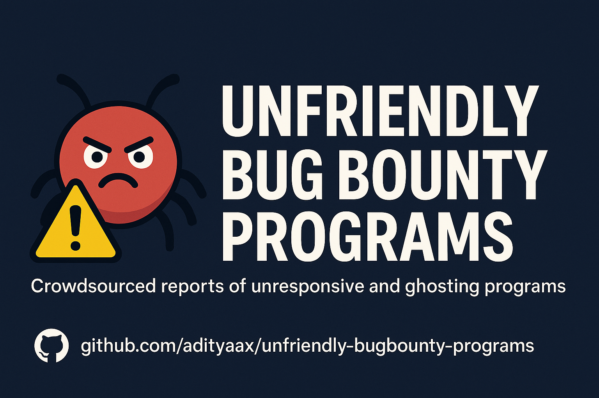

A community-curated list of companies and platforms that have demonstrated unfriendly or unfair behavior towards security researchers and bug hunters. This includes cases where valid vulnerability reports were:

- Ignored or ghosted  
- Silently patched without acknowledgment  
- Promised bounties or swag but never delivered  
- Met with invalid or dismissive excuses

> 🎯 **Goal:** Help the security research community avoid wasting time and encourage companies to improve their vulnerability disclosure practices.

---

## ⚖️ Disclaimer

This repository aims to document factual, verifiable experiences shared by researchers. It is **not intended to defame or harass** any company or individual. All entries are based on responsible disclosures and publicly available evidence.

---

## 🧾 Inclusion Criteria

Companies may be listed if:

- A valid vulnerability was responsibly reported  
- The company acknowledged but failed to reward as promised  
- The issue was silently fixed without credit or follow-up  
- The company responded with excuses despite clear evidence

---

## 💬 For Companies and Program Owners

If your company is listed here and you:

- Believe the entry is incorrect or unfair  
- Have resolved the issue with the researcher  
- Would like to provide an official update or statement

Please open a GitHub issue or contact us at **adityaax@proton.me** with:

- Company name  
- Explanation or update  
- Supporting evidence or links

We welcome transparency and will update or remove entries when appropriate.

---

## 🧑‍💻 How to Contribute

To report your experience, please open a [new GitHub issue](https://github.com/adityaax/unfriendly-bugbounty-programs/issues/new) using the provided issue template to ensure all relevant details are included.

Alternatively, you can submit a pull request adding your case to the `programs/` folder following the contribution guidelines.

## 🕵️‍♂️ Prefer to Stay Anonymous?
If you don't want to reveal your identity while submitting a report, you can email me directly.
I will list your report under Anonymous, but only for legit and verified submissions.

## 🙌 Contributors

Special thanks to the following people for their valuable issue reports and suggestions:

- [@fraklinde3mon](https://github.com/fraklinde3mon)
- [@FancybearIN](https://github.com/FancybearIN)
- [@adith-suhas-sv](https://github.com/adith-suhas-sv)

---

## 🛡️ Respectful and Verified Submissions Only

Please avoid submitting:

- Out-of-scope bugs where no bounty was expected  
- Personal disputes or non-technical complaints  
- Unverified or false claims

Focus on facts, proof, and respectful language.

---

## ❤️ About This Project

Inspired by the need for greater transparency in the bug bounty ecosystem, this project aims to empower researchers and encourage companies to foster fair vulnerability disclosure programs.

---

## 🙌 Support
If you find this useful, give the repo a ⭐ and share it with fellow researchers.

*Thank you to all the security researchers and ethical hackers who help make the digital world safer!*
